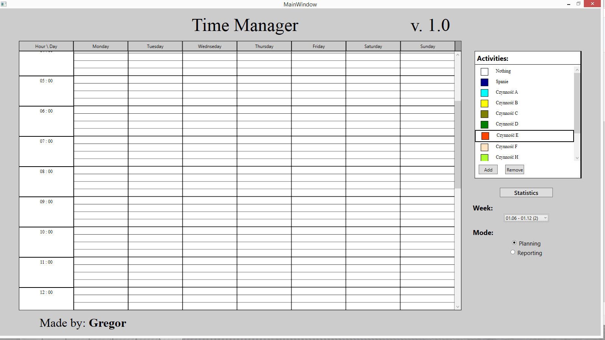
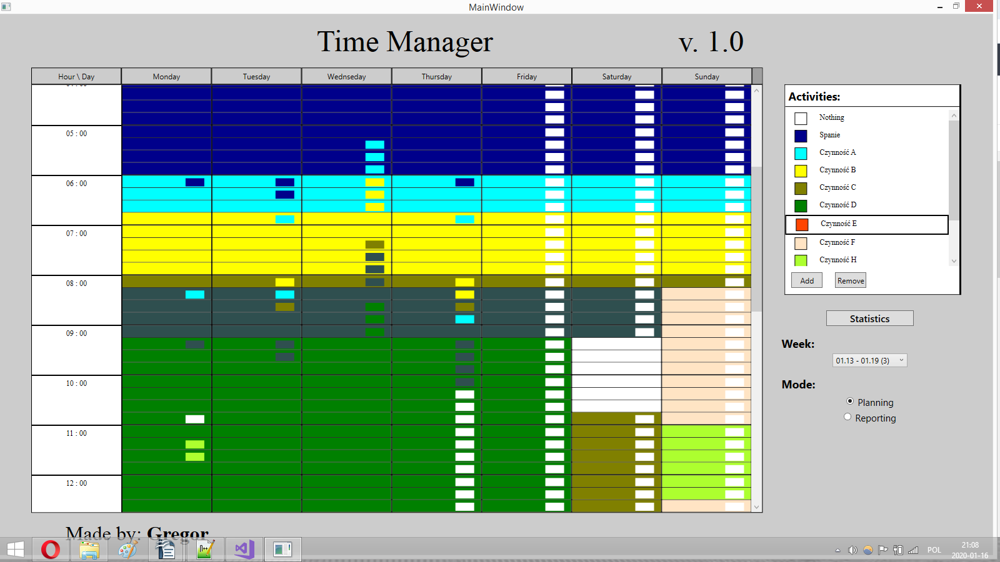
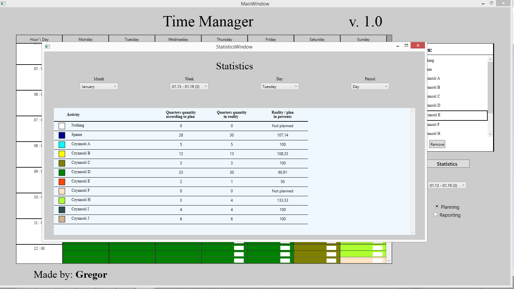

# Time Manager
> TimeManager is a program, which serves to make week plans. It also helps to estimate a degree of fullfilment of the plans. 

## Table of contents
* [General info](#general-info)
* [Screenshots](#screenshots)
* [Technologies](#technologies)
* [Setup](#setup)
* [Features](#features)
* [Status](#status)

## General info
Development of this project served improving skills in making WPF applications. Developed application has such functionalities (planning, estimating degree of plan realisation), because author decided that such application can be helpful for him.

## How to use (ilustrated with screenshots)
When application is opened for the first time or when has been chosen week where nothing had been planned yet, then the main window looks like this:

**Pic. No. 1.**  Main window appearance when nothing has been planned neither reported.

In the middle we can see timetable with a lot of rectangles. Each rectangle represents quarter. Each column represents a day. At the left side of timetable are labels which informs about hour. At the top of the timetable are labels which informs about day. Timetable can be scrolled. 

At the ride side of the main window we can see quite big white field with a title "Activities". In this field, under the title, are visible activities and each hat own color. Those activities were added via "Add" button which is at the bottom of the field. Beside "Add" button can be seen "Remove" button. It serves to removing activities - first activity must be chosen by clicking left mouse button (black border around activity will appear), then it can be removed by clicking "Remove" button. Only "activity", which can not be removed is a pseudoactivity "Nothing". 

Below activities field has been placed "Statistics" button. It allows to open Statistics window. Both statistics window and controls which are under the "Statistics" button will be discussed below. Before that, here is visible main widow when week is partialy fullfilled with plans and reports:

**Pic. No. 2.**  Main window appearance when almost for all time something was planned and for a lot of time something was reported.

Thus, as it was said, each rectangle represents one quarter. In the picture number 2, in some rectangles we can see smaller rectangles. Color of bigger rectangle informs about what was planned for given quarter and color of small rectangle says what has been reported for the quarter.

How to change a plan or a report for the specified quarter or group of quarters? At least two of three following steps must be executed:
1. **Changing marking mode** - possible modes are planning and reporting. Default mode is planning. Mode can be changed via checkbox which is under title-label "Mode" in the panel on the right side of main window. This step is optional - there is not need to change mode if correct is set. As well this step can be executed as second.
2. **Selecting quarters** - this can be done by clicking left mouse button on one of the quarters which should be selected and moving mouse over desired quarters with left mouse button still clicked. Selection will be indicated by black borders surrounding all selected quarters. This step can not be omitted. It can be executed as first step.
3. **Selecting activity** - this is done by clicking activity with left mouse button. After this action bigger rectangles (without fields of smaller rectangles - see Pic. No. 2.) obtain color, which is assigned to clicked activity, in case when planning mode is set. If reporting mode is set, smaller rectangles obtain the color. This step must be executed as last and of course it can not be omitted, if someone want to change a plan or report for chosen quarters.
    
And how to change week? It is very simply. To that serves the combobox which is below the title-label "Week" (at the right side of main window). Main window was discussed above, below is shown Statistics Window.

**Pic. No. 3.**  A screenshot showing Statistics Window.

In the statistics window, below the title, are four comboboxes. The first from the right combobox is used to determine the size of the period for which you want to see statistics. The period can have size of a day, a week or a month. The three other comboboxes are used to determine the location in time of the period for which the statistics we want to see. Statistics for selected span are displayed below comboboxes.

## Technologies
* WPF (C#) - target platform: .NET Framework 4.6.1
* SQLite - version 3.29.0

## Setup
Download project, unzip it and then:

Open TimeManager-master folder, then TimeManager, then bin folder, then Debug (or Release) folder, and at the end trace and launch TimeManager.exe.

## Features
List of features:
* enable to make plans and reports
* enable to review the statistics fot the selected period

To-do list (future development):
* Introduction of an additional window supporting the timetable fulfillment
* Adding graphic information whether the changes made have been saved in the database and a button enabling saving to the database
* Introducing the possibility of withdrawing the last few actions
* Adding charts to the statistics window
* Enabling data for the previous year to be recorded
* Enabling the statistics for the whole year to be reviewed

## Status
The project will be continued.

